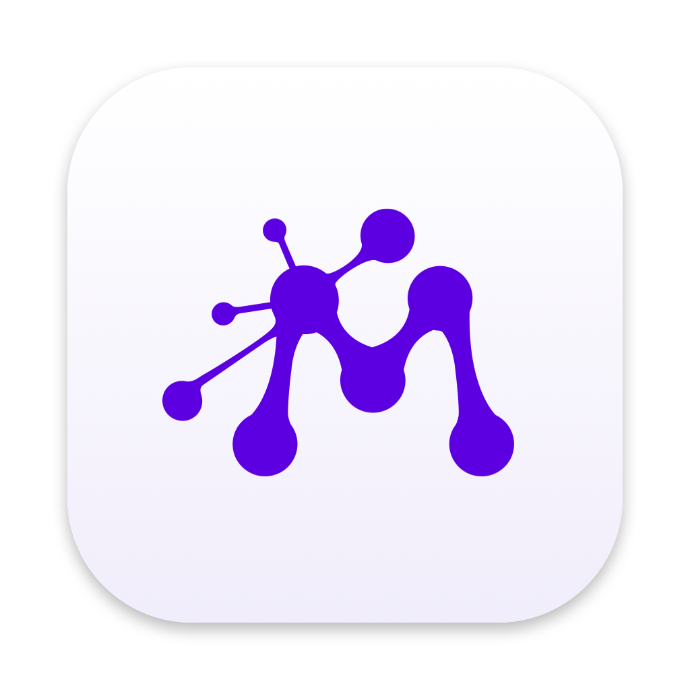

# Moxie Timer



A floating SwiftUI time-tracking widget for macOS that logs time to [Moxie](https://www.withmoxie.com) through the
[Moxie Public API](https://api-docs.withmoxie.com/reference/time-worked-create).

> [!IMPORTANT]
> **This is NOT an official Moxie product.** It's an independent, unofficial widget with no affiliation with or endorsement
> from Moxie, and it comes with no warranty. The authors take no responsibility for its use. See the [Disclaimer](#disclaimer).

- Floats above other windows on every Space (toggle in Settings). Drag it by the timer readout or the card header; the position is saved.
- Timer: start/pause/stop, ±5/±15 min nudges, editable start time or duration (`45m`, `1.5h`, `1:30`).
- Client → project → task → ticket pickers loaded live from Moxie, with search, plus a Billable toggle.
- Add a past block of time manually with the **+** button.
- Recent: today/this-week totals and a log of entries sent from this Mac. Hover a row to start a timer for it again.
- Menu bar item shows the running time, with start/pause/stop and show/hide.
- A running timer survives quitting and relaunching.
- Self-updates from GitHub Releases (see below).

## Download

Grab the latest `MoxieTimer-x.y.z.zip` from [Releases](https://github.com/flyingwebie/moxie-timer/releases/latest), unzip, and move it to /Applications.
The app is ad-hoc signed (not notarized): right-click → **Open** the first time, or run
`xattr -dr com.apple.quarantine /Applications/MoxieTimer.app`.

## Build & run

Requires macOS 14+ and Xcode 16+ (Swift 5.10+).

```sh
./scripts/build-app.sh            # → build/MoxieTimer.app
./scripts/build-app.sh --install  # copies to /Applications and launches
```

Add `--universal` for an Apple Silicon + Intel binary. For development you can also `open Package.swift` in Xcode and run the `MoxieTimer` scheme.

## Setup

1. In Moxie, open **Custom API** and choose **Enable**.
2. Copy the API key and the **workspace base URL** (e.g. `https://pod00.withmoxie.dev/api/public`) into the widget's Settings.
3. Enter the email of the Moxie user the time belongs to, or pick it from the workspace users list.
4. Press **Test connection**.

The API key is stored in the macOS Keychain. Because the build is ad-hoc signed, macOS may ask again for Keychain access after a rebuild.

## API limitations

| Moxie web widget | This widget | Why |
| --- | --- | --- |
| Billable toggle | Sent as `billable` (not in the documented schema) | The app checks the saved entry Moxie returns and tells you if the toggle was ignored. If Moxie rejects the field, the entry is saved again without it |
| Ticket link | Added to the entry's notes as `Ticket #123 …` | No ticket field on time entries |
| Recent list / edit entry | Local log of entries sent from this Mac | The API can't list, edit or delete time entries |
| Client logos | Initials | Not returned by `clients/list` |

Pauses are left out of the logged time. An entry is saved as one block that ends when you stop, and its start is `end − tracked duration`.

Endpoints used: `clients/list`, `projects/search`, `tasks/list`, `tickets/list`, `users/list`, `timeWorked/create`.

## Updates

On launch and every 6 hours, the app checks this repo's latest GitHub release. If the release tag (`v1.2.0`) is newer
than the installed version, a banner offers **Install & relaunch**. The app then downloads `MoxieTimer-<version>.zip`,
checks it against the `.sha256` file, swaps the app bundle in place and reopens it. A running timer carries over.
You can also check manually in Settings or from the menu bar, and turn automatic checks off.
The app has to be somewhere it can write to, such as /Applications, and not opened straight from Downloads.

## Releasing

```sh
./scripts/release.sh 1.2.0
```

This starts the **Release** workflow on GitHub. It builds a universal app, creates tag `v1.2.0`, and publishes
`MoxieTimer-1.2.0.zip` with a SHA-256 file. You can also run the workflow from the Actions tab or push a `v*` tag.
Installed copies offer the update automatically.

## Icon

The app icon is original artwork (`Support/AppIcon.svg`). It doesn't use any Moxie logo or brand asset.
Run `swift scripts/make-icon.swift` to rebuild `Support/AppIcon.icns` from it.

## Disclaimer

**Moxie Timer is an unofficial, independent project. It is not made, endorsed, sponsored or supported by Moxie
(withmoxie.com) or its owners.** "Moxie" is a trademark of its owner and is used here only to describe what the app works with.

This software is provided "as is", without warranty of any kind. The authors accept no responsibility or liability for
any loss of data, incorrect or missing time entries, billing errors, or any other damage arising from its use.
Use it at your own risk and check your time entries in Moxie.
